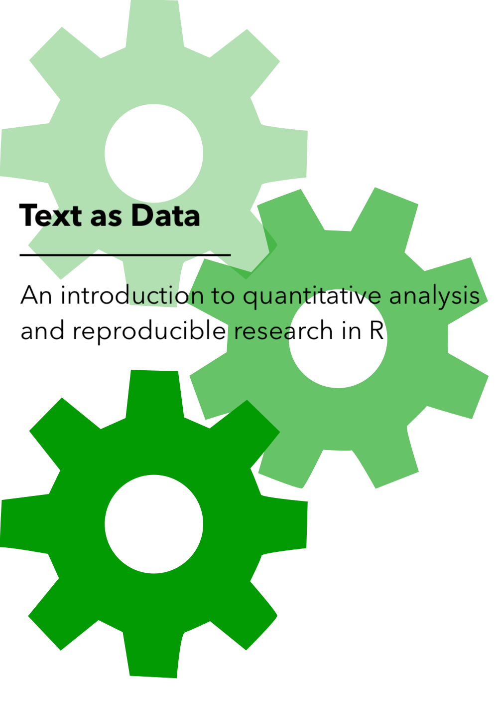

--- 
title: "Text as Data"
subtitle: "An introduction to quantitative analysis and reproducible research in R"
author: "Jerid C. Francom"
date: "April 30, 2019 (latest version)"
site: bookdown::bookdown_site
output: bookdown::gitbook
documentclass: book
bibliography: ["latex/textbook.bib", "latex/packages.bib"]
biblio-style: apalike
link-citations: yes
links-as-notes: true
linestretch: 1.5
github-repo: francojc/tad
description: "A textbook aimed at providing language researchers an introduction to text analysis literate programming concepts and coding practices."
---

<!-- TODOs:
- general setup for tools to work
  - glossary, screenshots (webshot)
  - default packages
  - ??
-->

# Welcome {- #welcome}

This is the website for *Text as Data: An introduction to quantitative analysis and reproducible research in R*

## Author {-}

Jerid Francom is Associate Professor of Spanish and Linguistics at Wake Forest University. His research interests are focused around quantitative approaches to language variation. 

